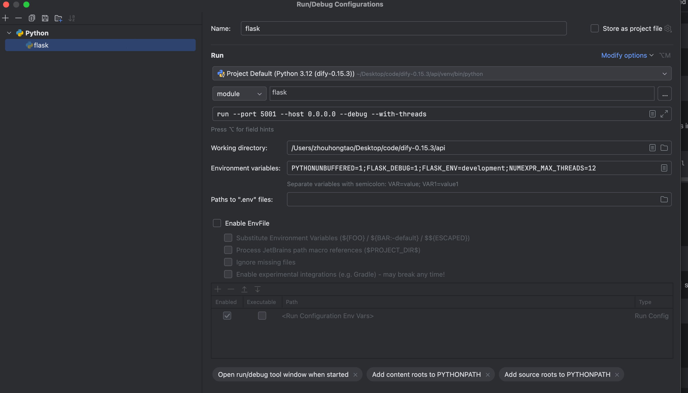
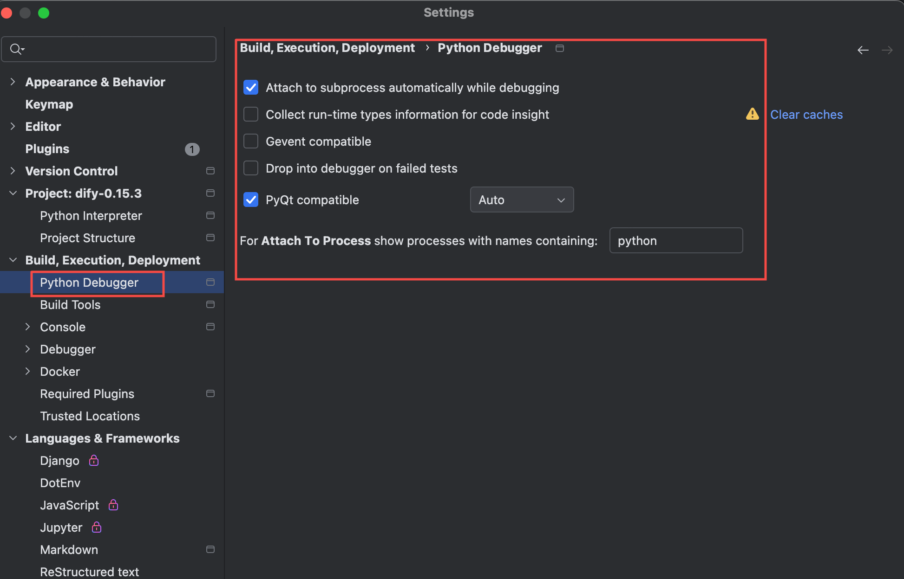

# Dify Backend API

## Usage

> [!IMPORTANT]
> In the v0.6.12 release, we deprecated `pip` as the package management tool for Dify API Backend service and replaced it with `poetry`.

1. Start the docker-compose stack

   The backend require some middleware, including PostgreSQL, Redis, and Weaviate, which can be started together using `docker-compose`.

   ```bash
   cd ../docker
   cp middleware.env.example middleware.env
   # change the profile to other vector database if you are not using weaviate
   docker compose -f docker-compose.middleware.yaml --profile weaviate -p dify_0_15_3 up -d
   cd ../api
   ```

2. Copy `.env.example` to `.env`

   ```cli
   cp .env.example .env 
   ```
3. Generate a `SECRET_KEY` in the `.env` file.

   bash for Linux
   ```bash for Linux
   sed -i "/^SECRET_KEY=/c\SECRET_KEY=$(openssl rand -base64 42)" .env
   ```
   bash for Mac
   ```bash for Mac
   secret_key=$(openssl rand -base64 42)
   sed -i '' "/^SECRET_KEY=/c\\
   SECRET_KEY=${secret_key}" .env
   ```

4. Create environment.

   - 第一种方式：Dify API service uses [Poetry](https://python-poetry.org/docs/) to manage dependencies. You can execute `poetry shell` to activate the environment.
   - 第二种方式：使用传统的virtualenv的方式创建虚拟环境，制定python路径为`/Users/zhouhongtao/Desktop/code/dify-0.15.3/api/venv` ,然后安装poetry `pip install poetry`

5. Install dependencies

   ```bash
   poetry env use 3.12
   poetry install
   ```

6. Run migrate

   Before the first launch, migrate the database to the latest version.

   ```bash
   poetry run python -m flask db upgrade
   ```

7. Start backend

   ```bash
   poetry run python -m flask run --host 0.0.0.0 --port=5001 --debug
   ```

8. Start Dify [web](../web) service.  
   ```bash
      docker compose -f docker-compose.web.yaml -p dify_0_15_3 up -d
   ```
9. Setup your application by visiting `http://localhost:3000`...
10. If you need to handle and debug the async tasks (e.g. dataset importing and documents indexing), please start the worker service.

   ```bash
   poetry run python -m celery -A app.celery worker -P gevent -c 1 --loglevel INFO -Q dataset,generation,mail,ops_trace,app_deletion
   ```

## Testing

1. Install dependencies for both the backend and the test environment

   ```bash
   poetry install -C api --with dev
   ```

2. Run the tests locally with mocked system environment variables in `tool.pytest_env` section in `pyproject.toml`

   ```bash
   poetry run -P api bash dev/pytest/pytest_all_tests.sh
   ```
   
## 本地debug方式
配置如下：


其中：
- 环境变量：PYTHONUNBUFFERED=1;FLASK_DEBUG=1;FLASK_ENV=development;NUMEXPR_MAX_THREADS=12
- work dir：/Users/zhouhongtao/Desktop/code/dify-0.15.3/api
- run param：run --port 5001 --host 0.0.0.0 --debug --with-threads
- python debugger配置：
