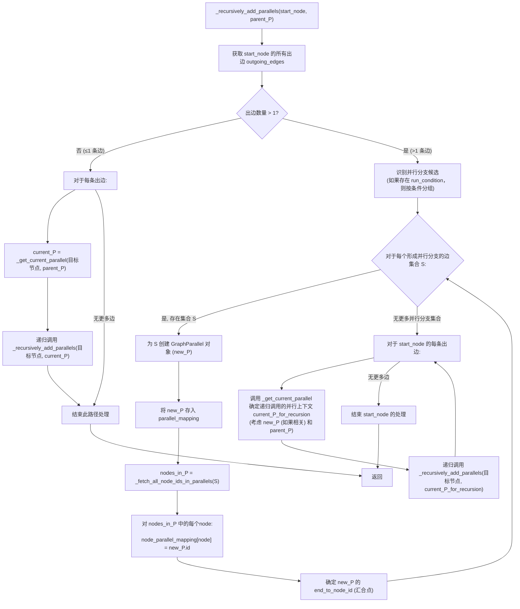

```mermaid
graph TD
    Start["_recursively_add_parallels(start_node, parent_P)"] --> GetEdges["获取 start_node 的所有出边 outgoing_edges"]
    GetEdges --> IsMultiEdge{"出边数量 > 1?"}

    IsMultiEdge -- "否 (≤1 条边)" --> HandleSinglePath["对于每条出边:"]
    HandleSinglePath --> GetCurrentP_NoMulti["current_P = _get_current_parallel(目标节点, parent_P)"]
    GetCurrentP_NoMulti --> Recurse_NoMulti["递归调用 _recursively_add_parallels(目标节点, current_P)"]
    Recurse_NoMulti --> EndPath["结束此路径处理"]
    HandleSinglePath -- "无更多边" --> EndPath

    IsMultiEdge -- "是 (>1 条边)" --> IdentifyPBranchCandidates["识别并行分支候选\n(如果存在 run_condition，则按条件分组)"]
    IdentifyPBranchCandidates --> ForEachPBranchSet{"对于每个形成并行分支的边集合 S:"}
    ForEachPBranchSet -- "是, 存在集合 S" --> CreatePObj["为 S 创建 GraphParallel 对象 (new_P)"]
    CreatePObj --> StorePObj["将 new_P 存入 parallel_mapping"]
    StorePObj --> FetchNodesInP["nodes_in_P = _fetch_all_node_ids_in_parallels(S)"]
    FetchNodesInP --> MapNodesToP["对 nodes_in_P 中的每个node:\n node_parallel_mapping[node] = new_P.id"]
    MapNodesToP --> DetEndNodeP["确定 new_P 的 end_to_node_id (汇合点)"]
    DetEndNodeP --> ForEachPBranchSet

    ForEachPBranchSet -- "无更多并行分支集合" --> RecurseForOutgoingEdges["对于 start_node 的每条出边:"]
    RecurseForOutgoingEdges --> DeterminePContext["调用 _get_current_parallel 确定递归调用的并行上下文 current_P_for_recursion\n(考虑 new_P (如果相关) 和 parent_P)"]
    DeterminePContext --> Recurse_Multi["递归调用 _recursively_add_parallels(目标节点, current_P_for_recursion)"]
    Recurse_Multi --> RecurseForOutgoingEdges
    RecurseForOutgoingEdges -- "无更多边" --> EndMultiPath["结束 start_node 的处理"]
    
    EndPath --> Return["返回"]
    EndMultiPath --> Return
```
