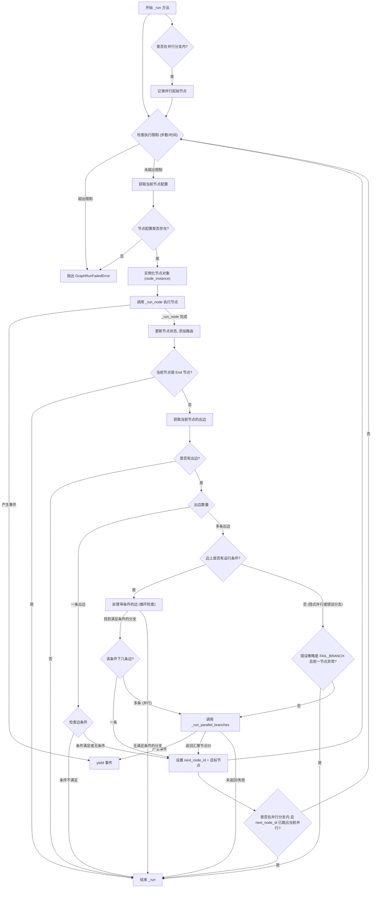

```mermaid
graph TD
    A[开始 _run 方法] --> B{"检查执行限制 (步数/时间)"};
    B -->|"超出限制"| C[抛出 GraphRunFailedError];
    B -->|"未超出限制"| D[获取当前节点配置];
    D --> E{"节点配置是否存在?"};
    E -->|"否"| C;
    E -->|"是"| F["实例化节点对象 (node_instance)"];
    F --> G["调用 _run_node 执行节点"];
    G -->|"产生事件"| H[yield 事件];
    G -->|"_run_node 完成"| I["更新节点状态, 添加路由"];
    I --> J{"当前节点是 End 节点?"};
    J -->|"是"| K[结束 _run];
    J -->|"否"| L["获取当前节点的出边"];
    L --> M{"是否有出边?"};
    M -->|"否"| K;
    M -->|"是"| N{"出边数量"};
    N -->|"一条出边"| O{"检查边条件"};
    O -->|"条件不满足"| K;
    O -->|"条件满足或无条件"| P["设置 next_node_id = 目标节点"];
    P --> B;
    N -->|"多条出边"| Q{"边上是否有运行条件?"};
    Q -->|"是"| R["处理带条件的边 (循环检查)"];
    R -->|"找到满足条件的分支"| S{"该条件下几条边?"};
    S -->|"一条"| P;
    S -->|"多条 (并行)"| T["调用 _run_parallel_branches"];
    T -->|"产生事件"| H[yield 事件];
    T -->|"返回汇聚节点ID"| P;
    T -->|"未返回/失败"| K;
    R -->|"无满足条件的分支"| K;
    Q -->|"否 (隐式并行或错误分支)"| U{"错误策略是 FAIL_BRANCH 且前一节点异常?"};
    U -->|"是"| K;
    U -->|"否"| T;
    A --> X{"是否在并行分支内?"};
    X -->|"是"| Y["记录并行起始节点"];
    Y --> B;
    P --> Z{"是否在并行分支内 且 next_node_id 已跳出当前并行?"};
    Z -->|"是"| K;
    Z -->|"否"| B;
```